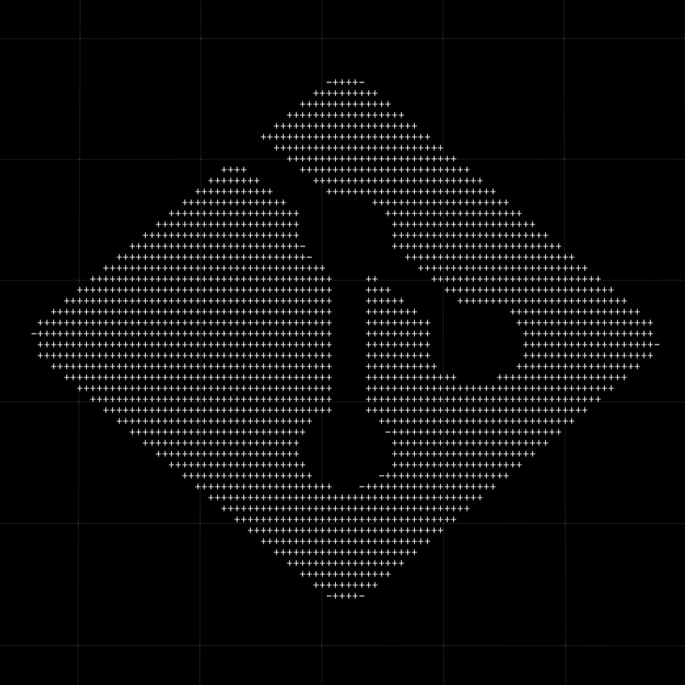

# TimeWrap



CHECKOUT TEST RESULT AT: [OmPreetham 2016 Contribution Graph](https://github.com/OmPreetham?tab=overview&from=2016-12-01&to=2016-12-31)

## Commit Anywhere in Time

TimeWrap is a web application that allows you to create and customize your GitHub contribution graph. Design your own contribution pattern and export it as Git commands to recreate the pattern on your actual GitHub profile.

## Features

- Interactive contribution grid for any year
- Customizable commit messages
- Export your design as Git commands
- Save and load your designs
- Dark and light mode support
- Responsive design for desktop and mobile
- PWA support for offline use

## How to Use

### Keyboard Controls

- **Arrow keys**: Navigate between days
- **Spacebar**: Toggle contribution for selected day
- **Enter**: Edit commit message for selected day

### Touch Controls

- **Tap**: Toggle contribution for a day
- **Double tap**: Edit commit message for a day

### Creating Your Pattern

1. Select a year using the input at the top
2. Tap on days to toggle contributions
3. Double tap on a day with a contribution to add a custom commit message
4. Use the "Commits" button to view and copy all your commit commands
5. Save your pattern using the "Save" button
6. Export your pattern as a JSON file using the "Export" button

### Applying Your Pattern to GitHub

1. Create a new Git repository or use an existing one
2. Copy the Git commands from the "Commits" panel
3. Paste and run the commands in your terminal
4. Push the commits to GitHub
5. Your GitHub contribution graph will reflect your custom pattern

## Installation

### Development

```bash
# Clone the repository
git clone https://github.com/OmPreetham/timewrap.git

# Navigate to the project directory
cd timewrap

# Install dependencies
npm install

# Start the development server
npm run dev
```

